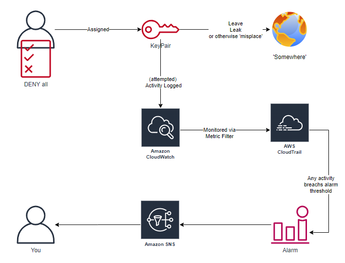
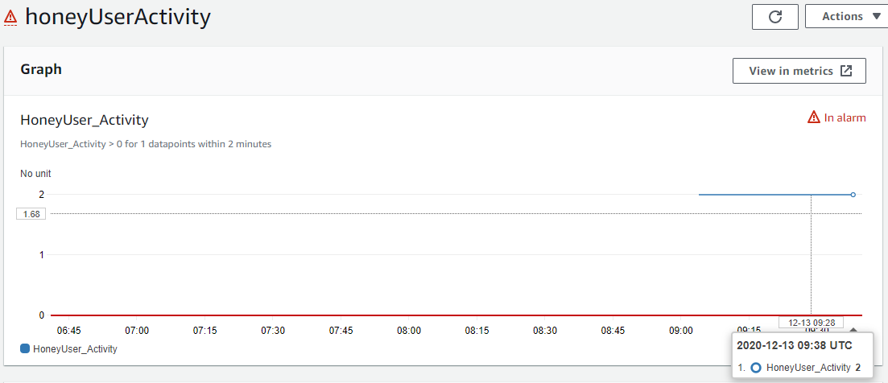
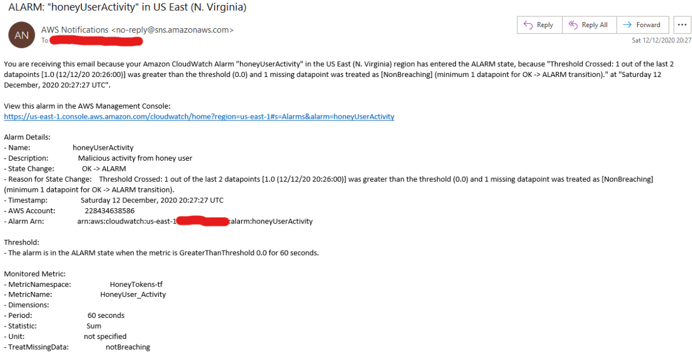

# AWS Honey Users
## Overview
This project creates one (or more) deception users with permissionless secret key pairs, and deploys controls to monitor for any activity from the dummy accounts.

The deployed architecture looks like:

1.  Created user(s) are assigned a restrictive IAMs policy

        {
            "Action": "*",
            "Effect": "Deny",
            "Resource": "*"
        }
2. Access key pairs are generated (and displayed via Terraform's *output* blocks - normally this would be a bad idea for keys; but, use-case...)
3. Any activity related to the key pairs is logged via CloudTrail (this project assumes full, multi-region CloudTrail is already active in your account. If not, start [here](https://docs.aws.amazon.com/securityhub/latest/userguide/securityhub-standards-fsbp-controls.html#fsbp-cloudtrail-1))
4. When activity occurs, the Cloudwatch alarm is breaching, triggering a notification to SNS
5. N.B. Subscribing to the SNS topic is left as an exercise for the reader; we're not defining, nor predicting, how your use-case wants to consume the alerts.

## Deployment
Deployment is via [Terraform](https://terraform.io). 

Before deployment, there's two locations that you'll need to update.

### provider.tf-dist

    provider "aws" {
      version = "~> 2.0"
      region  = "eu-west-1"
      profile = "ENTER-YOUR-PROFILE-HERE"
    }

As suggested, you'll need to update your profile name. Or replace with static keys, but if you're interested in this project you probably understand why that could be a bad idea....

And depending on where your workloads reside, you may need to update your region to suit you needs

### terraform.tfvars-dist
    cloudtrail_logs = "YOUR CLOUDTRAIL LOG GROUP HERE"

Again, as suggested add the name of the CloudWatch Log Group that is fed the cloudtrail logs that you'll be monitoring for activity

### Rename *-dist files
Once updated, rename all *-dist files to lose the *-dist* and you should be good to go.

### (Actual) Deployment
Now the project is configured to your needs, standard Terraform deployment process applies:

    > terraform init
    > terraform apply

### Outputs
If all successful, terraform should return your deception token(s) at the end of it's output:

    Outputs:

    key = "AKIA<redacted>"
    secret = "<redacted>"

## Testing
After deployment, any activity should raise the CloudWatch metric over it's threshold, pushing it into an alarm state.

And triggering an SNS notification, in my demo use-case, an email:

